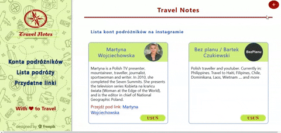

## Project Title

Travel Notes

Project was created based on course React in eduweb.pl, created by Adam Romański.
I've changed / add own layout, content, menu, RWD, and add some function like validation form, delate element.

## See live

# <a href="https://kamiladyn.github.io/Travel-Notes/#/">LIVE VIEW</a>

## Technologies used

1. React
2. JS
3. SASS

## status

Still in progress, but MVP is ready.

## Demo View

### Installing

Tu start you need to install package npm install
and also :

npm install react-router-dom

if you want to use sass:

npm install node-sass

### To start

npm start

## Author

Kamila Dynysiuk

If you want to share with your thoughts about this project please write me priv message or email kamila0990@gmail.com
